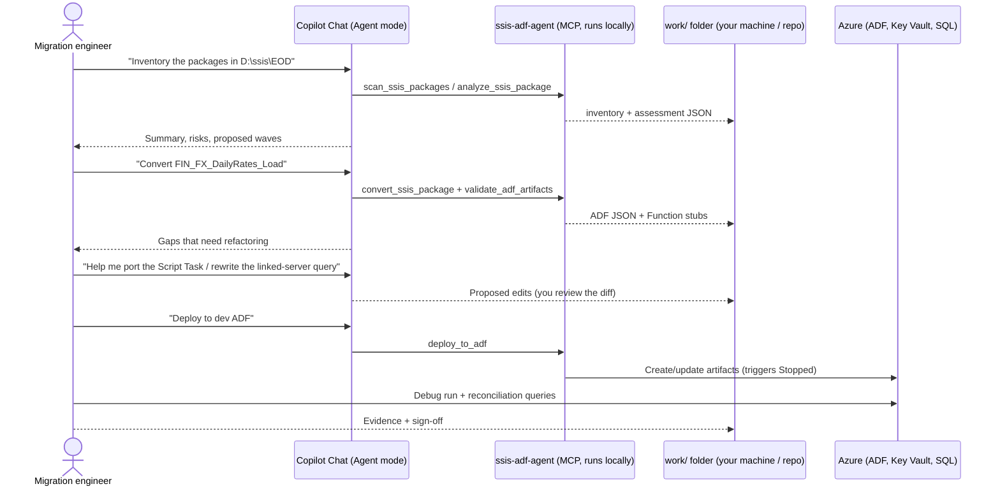
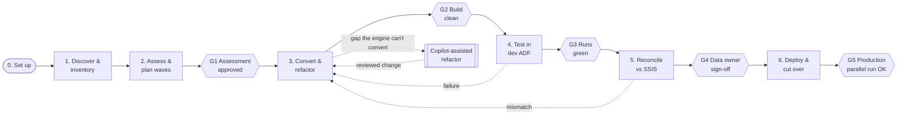

# Customer flow: from SSIS packages to trusted ADF pipelines

This guide is for the teams who will run the solution themselves: migration engineers, data owners and platform admins. It describes:

- how you interact with the solution,
- the six phases every package goes through, from analysis to deployment,
- what you get out of each phase, and
- the evidence gate a package must pass before it moves on.

Each step is marked with its status today:

| Marker | Meaning |
|---|---|
| ✅ | Available in this repo today |
| ⚠️ | Available, with known limitations (see [Known limitations](#known-limitations-read-before-using-output)) |
| 🧑‍💻 | Done today by you, with help from Copilot (guided by prompt files) |
| 🔜 | Planned. See the [platform plan](AI_MIGRATION_PLATFORM_PLAN.md) |

> **The core principle.** The deterministic engine converts what it knows. The AI agent helps with what the engine can't convert. No package counts as migrated until the **evidence** says so: validation, a test run and reconciliation. You approve each step.

---

## 1. How you interact with it

You work in **VS Code with GitHub Copilot Chat in Agent mode**. This repo registers an MCP server (`ssis-adf-agent`) that gives Copilot its migration tools. You describe what you want in plain language, or run one of the guided prompt files. Copilot calls the tools, explains the results and helps with the refactoring. You review and approve the changes.



There are three ways to drive it:

| Mode | When to use it | Status |
|---|---|---|
| **Copilot Chat, free-form**, e.g. "analyze every package under D:\ssis and rank by risk" | Exploring, asking questions, refactoring help | ✅ |
| **Guided prompt files**: type `/` in Copilot Chat and pick a prompt (see the [prompt catalog](#5-prompt-catalog)) | Repeatable phase-by-phase runs | ✅ |
| **Headless / CI**: run the same engine from scripts or a pipeline, with no chat | Bulk runs and regression checks | 🔜 (today: `python scripts/verify_install.py` and `samples/fsi/tools/validate_corpus.py` show how to call the engine directly) |

### Where your data goes

- The engine runs **locally**. It reads `.dtsx` files and writes JSON to the folder you choose.
- Copilot Chat sends whatever it reads (tool results and files you open) to the Copilot model service under your organisation's Copilot policy. If your packages contain sensitive SQL or names, check that policy first.
- Optional LLM translation of Script Tasks (`llm_translate=true`) sends C# source to **your** Azure OpenAI deployment.
- Deployment uses your Azure identity (`az login` or a service principal). Nothing is deployed unless you ask for it.

---

## 2. The migration flow



Packages move through the flow one at a time, in **waves**. A wave is a group of packages that depend on each other and are released together, for example a master package plus its children.

### Recommended working folder

Keep everything for a migration in one folder, ideally in **your own** Git repo, so the evidence is versioned. `work/` is git-ignored in this repo so you can't accidentally commit customer packages to it.

```
work/<migration-name>/
  01_inventory/       inventory.md, packages.json
  02_assessment/      <Package>.analysis.json, assessment.md, decisions.md, waves.md
  03_adf/<Package>/   generated + refactored ADF JSON, stubs/  ← edit here, review diffs
  04_tests/           test-plan.md, run IDs, screenshots/exports of debug runs
  05_recon/           recon queries, results, sign-off
  06_release/         deployment log, cut-over checklist, approvals
```

---

## 3. Phase by phase

### Phase 0: Set up (once per machine)

| Step | How | Status |
|---|---|---|
| Install Python 3.11+, VS Code, GitHub Copilot | See [SETUP.md](../SETUP.md) | ✅ |
| `pip install -e .` in a venv | `.vscode/mcp.json` registers the server automatically | ✅ |
| Check the install | `python scripts/verify_install.py` lists the 5 tools and analyzes a sample package | ✅ |
| Try it on the FSI sample corpus first | `samples/fsi/` | ✅ |
| Copy `.env.example` → `.env` and fill in Azure / OpenAI values if needed | Optional | ✅ |

### Phase 1: Discover and inventory

**Goal:** find every package and list what it touches.

| | |
|---|---|
| **You provide** | A folder of `.dtsx` files, a Git repo URL, or a SQL Server (`msdb`) connection |
| **Engine** | `scan_ssis_packages` finds the packages. `analyze_ssis_package` extracts connections, tasks, data flows, parameters and cross-database references |
| **AI** | Summarises the estate: which systems are touched, which packages share connections, and which ones look unusual |
| **Output** | `01_inventory/inventory.md`: package, connection managers, source/target systems, schedule, owner |
| **Prompt** | `/analyze_packages` |
| **Status** | ✅ local / Git / msdb · 🔜 SSISDB catalog, environments and SQL Agent job export · 🔜 Excel inventory |

### Phase 2: Assess and plan waves

**Goal:** decide *how* each package will migrate, and in what order.

| | |
|---|---|
| **Engine** | Complexity score, gap analysis (`manual_required`, `warning`, `info`), dependency order between packages |
| **AI** | Explains each gap in business terms, proposes the target pattern (Copy, Mapping Data Flow, stored procedure, Azure Function) and groups packages into waves |
| **You decide** | Target platform (Azure SQL DB, Managed Instance or Fabric), Self-hosted IR placement, Key Vault, how to handle linked servers and local executables, and who owns each package |
| **Output** | `02_assessment/assessment.md`, `decisions.md`, `waves.md` |
| **Gate G1** | The assessment is reviewed, every `manual_required` gap has an owner and an approach, and the wave plan is agreed |
| **Status** | ✅ scoring, gaps, ordering · ⚠️ some FSI patterns are not flagged (see limitations) · 🧑‍💻 wave planning with Copilot |

### Phase 3: Convert and refactor

**Goal:** produce ADF artifacts that are *buildable*, then close the gaps.

1. **Convert (engine).** `convert_ssis_package` writes pipeline, linkedService, dataset, dataflow, trigger and `stubs/` into `03_adf/<Package>/`.
2. **Refactor (AI-assisted, you approve).** For each gap, use `/refactor_gaps`. Copilot reads the gap list and the original package logic, then proposes a change. Typical refactors:
   - **Script Task (C#)** → Azure Function (Python), keeping the original variable contract
   - **Linked server / four-part names** → external table, elastic query or a separate source
   - **SCD wizard / OLE DB Command** → set-based `MERGE` in a stored procedure, or a Mapping Data Flow
   - **Fuzzy Lookup** → a redesign decision (for example, a matching service), documented in `decisions.md`
   - **Local executables (gpg, WinSCP)** → Azure Function or Batch, and SFTP linked service
   - **Secrets** → Key Vault references
3. **Validate.** Run `validate_adf_artifacts` after every edit, and check the [pipeline review checklist](#pipeline-review-checklist).

| | |
|---|---|
| **Output** | Refactored `03_adf/<Package>/` (committed, with reviewed diffs) |
| **Gate G2** | Validation is clean, there are no dangling references, every `manual_required` gap is closed or has a documented decision, and the activity order (`dependsOn`) matches the SSIS control flow |
| **Status** | ⚠️ conversion · 🧑‍💻 refactoring via Copilot + prompt · 🔜 reusable refactor playbooks and AI fixes promoted into converter rules |

### Phase 4: Test in a dev Data Factory

**Goal:** prove the pipeline runs.

| | |
|---|---|
| **Engine** | `deploy_to_adf` to a **dev** factory. Triggers are always deployed **Stopped** |
| **You** | Deploy any Azure Functions and grant access. Run the pipeline in **Debug** against dev/test data. Record the run IDs |
| **AI** | Reads failed activity output and suggests fixes (which loop back to Phase 3) |
| **Output** | `04_tests/test-plan.md`, run IDs, evidence of the runs |
| **Gate G3** | Every activity succeeds on representative inputs, including the error paths you care about (bad file, no rows, timeout) |
| **Status** | ✅ deploy · 🧑‍💻 running and collecting evidence · 🔜 automated test runner |

### Phase 5: Reconcile against SSIS

**Goal:** prove the pipeline produces the **same data** as SSIS, not just that it runs.

Run SSIS and ADF on the **same input** for the same business date, then compare the outputs:

| Check | Example | Catches |
|---|---|---|
| Row counts per target and per reject/side table | `COUNT(*)` by `BusinessDate` | Dropped rows (e.g. an unconnected split output) |
| Control totals | `SUM(Amount)`, `SUM(Quantity)` by currency or account | Rounding, decimal precision, wrong FX date |
| Key-set diff | `EXCEPT` both ways on business keys | Join-semantic changes (nulls, many-to-many) |
| Row hash diff | `HASHBYTES` over the business columns | Silent value changes |
| File comparison | Byte length and SHA-256 | Fixed-width/NACHA files, exports |
| Alert/case sets | Compare the sets of flagged IDs | AML, sanctions and fraud logic, where counts can match while the members differ |

| | |
|---|---|
| **AI** | `/reconcile_package` reads the package analysis and writes the reconciliation SQL for its targets |
| **Output** | `05_recon/` queries, results and the agreed tolerances |
| **Gate G4** | Every check passes or falls within the documented tolerance, and the **data owner signs off** |
| **Status** | 🧑‍💻 queries generated by Copilot and run by you · 🔜 reconciliation engine and report |

### Phase 6: Deploy and cut over

**Goal:** release safely and retire the SSIS package.

1. Promote the artifacts dev → test → prod. Use ADF Git integration and CI/CD (ARM / `@microsoft/azure-data-factory-utilities`) for anything beyond dev. `deploy_to_adf` is meant for dev.
2. **Parallel run:** keep SSIS as the system of record and run ADF alongside it. Reconcile each day (repeat Phase 5).
3. Activate the triggers, switch consumers over and disable the SQL Agent job.
4. Archive the SSIS package and the evidence pack.

| | |
|---|---|
| **Gate G5** | The agreed number of clean parallel runs is reached, operations runbooks and alerts are in place, and the change is approved |
| **Status** | ✅ dev deploy · 🧑‍💻 CI/CD, parallel run and cut-over · 🔜 generated cut-over checklist and evidence pack |

---

## 4. Readiness gates at a glance

| Gate | A package is… | Evidence |
|---|---|---|
| **G1** | Assessed | Assessment, decisions, owner, wave |
| **G2** | Buildable | Clean validation, no open `manual_required` gaps, `dependsOn` reviewed |
| **G3** | Runnable | Successful dev run IDs, including error paths |
| **G4** | Trusted | Reconciliation results within tolerance, data owner sign-off |
| **G5** | Live | Clean parallel runs, change approval, SSIS retired |

Track the gates per package in `work/<migration-name>/status.md`. Copilot can keep it up to date when you ask.

---

## 5. Prompt catalog

All prompt files live in `.vscode/`. In Copilot Chat (Agent mode), type `/` and pick one.

| Phase | Prompt | What it does |
|---|---|---|
| 1–2 | `/analyze_packages` | Scan a source, analyze every package and rank them by complexity and gaps |
| 3 | `/convert_package` | Analyze, convert and validate one package, and list the manual steps |
| 3 | `/refactor_gaps` | Work through a converted package's gaps one at a time, proposing reviewed edits |
| 5 | `/reconcile_package` | Generate reconciliation queries and a sign-off template for one package |
| 4, 6 | `/deploy_adf` | Validate, then deploy to a (dev) Data Factory |

---

## Pipeline review checklist

Check these in every generated pipeline before G2. Several cover known engine gaps.

- [ ] **Activity order:** every activity's `dependsOn` matches the SSIS precedence constraints, including Failure, Completion, expression and OR paths.
- [ ] **Data flows inside containers** (Foreach, Sequence) exist under `dataflow/` and are referenced correctly.
- [ ] **Linked services referenced by activities exist**, e.g. `LS_AzureFunction` for Script Task stubs.
- [ ] **Datasets** exist for every Copy source and sink.
- [ ] **Variable types**: Int/DateTime/Boolean variables are not left as String.
- [ ] **Secrets** come from Key Vault, and there are no plaintext passwords.
- [ ] **Local paths** (`\\server\share`, `D:\`) are replaced with storage paths.
- [ ] **Triggers** are Stopped, and the schedule matches the SQL Agent job.

## Known limitations (read before using output)

The engine was tested against the [FSI sample corpus](../samples/fsi/README.md#sprint-1-results-current-main-engine). Until the items below are fixed, treat generated pipelines as a **starting point that you review**:

| Limitation | What to do today |
|---|---|
| **Activity ordering is not generated** (`dependsOn` is empty) for SSIS 2012+ packages | Add `dependsOn` by hand from the SSIS control flow, using the checklist above |
| OR constraints become AND, and expression constraints may be misread | Check precedence constraints by hand |
| Data flows inside containers aren't generated, and `LS_AzureFunction` isn't generated | Ask Copilot to generate them (`/refactor_gaps`) |
| No datasets are generated for data-flow sources and sinks | Create them with `/refactor_gaps` |
| Variable data types are lost | Fix the types in the pipeline `variables` |
| Execute Process Task shows as UNKNOWN | Redesign as an Azure Function or Batch job |
| `validate_adf_artifacts` doesn't detect dangling references | Use the checklist above |

These limitations are the top of the engineering backlog in the [platform plan](AI_MIGRATION_PLATFORM_PLAN.md).
